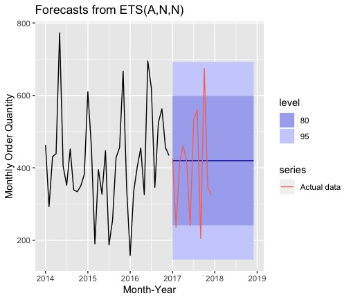

```{r setup, include=FALSE}
knitr::opts_chunk$set(echo = FALSE)
library(tidyverse) #General-purpose data wrangling
library(lubridate) #Eases DateTime manipulation
library(zoo) #for as.Date
library(dplyr) #For grouping and counting the rows per month
library(ggplot2)
library(readr)
library(knitr)

data <- read.csv("storedata.csv")
```

The first task for this week is to calculate the total Sales by month for the last 3 months of 2017, for Region 1 and Region 9, in the Customer_Segment "Corporate" and "Consumer".

```{r}
q1 <- data %>%
    mutate(Order_Date = as.Date(data$Order_Date, format = "%Y-%m-%d")) %>%
  filter(Order_Date >= as.Date('2017-10-01') & Order_Date <= as.Date('2017-12-31')) %>%
  filter(Region == "Region 1" | Region == "Region 9") %>%
  filter(Customer_Segment == "Corporate" | Customer_Segment == "Consumer") %>% 
  select(Order_Date, Sales, Region) %>%
  group_by(Region, as.yearmon(Order_Date)) %>%
  summarise(Total_Sales = sum(Sales)) 
colnames(q1)[2] <- "Month_Year"
kable(q1, caption = "Table 1")
```

The second task asks us to make a plot of the monthly total Sales in Region 1 and Region 13 in 2015, 2016 and 2017.

```{r}
q2 <- data %>%
  mutate(Order_Date = as.Date(data$Order_Date, format = "%Y-%m-%d")) %>%
  filter(Order_Date >= as.Date('2015-01-01') & Order_Date <= as.Date('2017-12-31')) %>%
  filter(Region == "Region 1" | Region == "Region 13") %>%
  select(Order_Date, Sales, Region) %>%
  group_by(Region, as.yearmon(Order_Date)) %>%
  summarise(Total_Sales = sum(Sales)) 

colnames(q2)[2] <- "Month_Year"

# Figure 1
ggplot(q2, aes(x=Month_Year, y=Total_Sales, color=Region, fill=Region)) +
  scale_x_continuous() +
  geom_line() + 
  geom_point(alpha=0.4) +
  xlab("Date") + 
  ylab("Total sales per month") + 
  ggtitle("Figure 1 - Monthly sales")
```

Task 3 asks to identify the months where the total Sales in Region 13 is greater than the total Sales in Region 1. 
```{r}
q3 <- q2 %>% 
  spread(Region, Total_Sales) %>% 
  filter(`Region 13` > `Region 1`) #use `` to make the text not a string, but a evaluatable object
kable(q3, caption = "Table 2")
```

Task 4 is to find the average Profit per Customer_Segment and Product_Category in 2017, for all regions except Region 3, 5 and 8.
```{r}
q4 <- data %>%
  mutate(Order_Date = as.Date(data$Order_Date, format = "%Y-%m-%d")) %>%
  filter(Order_Date >= as.Date('2017-01-01') & Order_Date <= as.Date('2017-12-31')) %>%
  filter(Region != "Region 3" & Region != "Region 5" & Region != "Region 8") %>% 
  group_by(Customer_Segment, Product_Category) %>% 
  summarise(average_profit = mean(Profit)) %>% 
  arrange(desc(average_profit))

kable(q4, caption = "Table 3")
```

The segment which produced the highest average profit was: `r kable(q4[1,])`

The final task, Taks 5, asks to estimate a SARIMA model on the aggregated monthly Order_Quantity in the Customer_Segment; Small Business and Product_Category; Office Supplies.
We are asked to iterate the following SARIMA parameters:

* p and q over 0,1,2,3,4, 
* d and D over 0,1, 
* P and Q over 0,1,2,3,4, 
* S fixed at 12 

This gives a total of 2500 models.
```{r}
iterations <- expand.grid(list(
  p = c(0:4), d = c(0:1), q = c(0:4),
  P = c(0:4), D = c(0:1), Q = c(0:4),
  S = 12)) 
```


To estimate these models we take the monthly data from 2014 through 2016 first
```{r}
q5_data <- data %>%
  mutate(Order_Date = as.Date(data$Order_Date, format = "%Y-%m-%d")) %>%
  filter(
    Order_Date >= as.Date('2014-01-01') & Order_Date <= as.Date('2016-12-31'),
    Customer_Segment == "Small Business",
    Product_Category == "Office Supplies"
  ) %>% 
  select(Order_Date, Order_Quantity) %>%
  group_by(Order_Date = as.yearmon(Order_Date)) %>%
  summarise(Monthly_Order_Quantity = sum(Order_Quantity)) %>% 
  arrange(Order_Date)

q5_data
```

and then take the same data for 2017, which will be used as the benchmark.
```{r}
q5_2017 <- data %>%
  mutate(Order_Date = as.Date(data$Order_Date, format = "%Y-%m-%d")) %>%
  filter(
    Order_Date >= as.Date('2017-01-01') & Order_Date <= as.Date('2017-12-31'),
    Customer_Segment == "Small Business",
    Product_Category == "Office Supplies"
  ) %>% 
  select(Order_Date, Order_Quantity) %>%
  group_by(Order_Date = as.yearmon(Order_Date)) %>%
  summarise(Monthly_Order_Quantity = sum(Order_Quantity)) %>% 
  arrange(Order_Date)

q5_2017
```


After this, we need to identify the best SARIMA model on a holdout sample from 2017, based on the smallest RMSE (Root Mean Square Error). 
```{r}
min_rmse <- Inf #set to +infinite to start
rmse_func = function(pred, label) sqrt(sum((pred - label) ^ 2)) #RMSE formula
```

The code below is what was run but it takes a long time to execute so here only the code is shown.
```{r eval=FALSE}
for(p in 0:4) for (d in 0:1) for (q in 0:4) for (P in 0:2) for (D in 0:1) for (Q in 0:4) {
  tryCatch({ # Catches any errors which might occur during execution
    arima_model <- 
      arima(as.numeric(q5_data$Monthly_Order_Quantity), 
            order = c(p, d, q), 
            seasonal = list(order = c(P, D, Q), period = 12))   
    
    #forecast (for 2017)
    variable <- forecast(object = arima_model, h = 12)
    prediction_2017 <- variable$mean
    
    #arrange RMSE (forecast, actual) 
    rmse <- rmse_func(prediction_2017, q5_2017$Monthly_Order_Quantity)
    
    #Best model
    if(rmse < min_rmse) {
      min_rmse <- rmse
      best_model <- arima_model
    }
    
  }, error = function(e){ #Print error "location"
    print(paste(p,d,q,P,D,Q))
  })
```

The plot of the whole time series, with the 2017 forecast from the best SARIMA model, together with the actual aggregated monthly Order_Quantity (in red) is shown below in Figure 2




and was found with the following code:

```{r, eval=FALSE, echo=TRUE}
arima_model %>% 
  forecast() %>% 
  autoplot

TS <- ts(q5_data$Monthly_Order_Quantity, 
         start = c(2014,1), end = c(2016,12), frequency = 12) 
  
p <- TS %>% 
  forecast() %>% 
  autoplot(xlab = "Month-Year", 
           ylab = "Monthly Order Quantity") +
  autolayer(ts(q5_2017$Monthly_Order_Quantity, 
               start=c(2017,1), end=c(2017,12), frequency=12), 
            series="Actual data")
```


The best SARIMA model on the plot was:

> Call:
arima(x = as.numeric(q5_data$Monthly_Order_Quantity), order = c(p, d, q), seasonal = list(order = c(P, 
    D, Q), period = 12))

> Coefficients:
         ar1     ar2     ma1      ma2      ma3     sma1
      0.0524  0.6402  0.2123  -0.9999  -0.2123  -0.4498
s.e.  0.2516  0.1685  0.3429   0.2025   0.2748   0.5213
         sma2  intercept
      -0.5502   415.2345
s.e.   0.3676    11.6793

> sigma^2 estimated as 9065:  log likelihood = -223.44,  aic = 464.89
